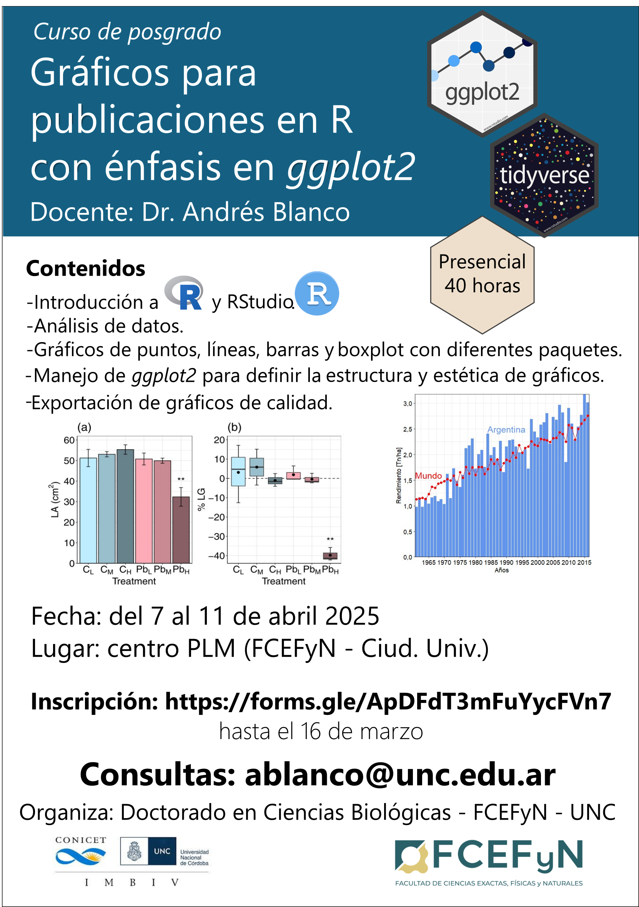

```{r setup, include=FALSE}
knitr::opts_chunk$set(echo = TRUE)
```

<p align="center">



</p>

# Índice de contenidos

-   [**Presentación del curso**](presentacion/presentacion.html)
-   [**Unidad 1. Introducción a R y RStudio**](unidad_1/unidad_1.html)
-   [**Unidad 2. Análisis y representación de datos numéricos**](unidad_2/unidad_2.html)
-   [**Unidad 3. Análisis y representación de datos categóricos**](unidad_3/unidad_3.html)
-   [**Unidad 4. Estructura y estética de gráficos con ggplot2**](unidad_4/unidad_4.html)
-   [**Unidad 5. Otros tipos y parámetros gráficos**](unidad_5/unidad_5.html)


**Visualiza el curso completo [aquí](curso_completo/curso_R_2025.html)**

**Descarga todo el material del curso [aquí](https://github.com/andresblanco-unc/curso_graficos_ggplot/raw/refs/heads/main/bases.zip)**

## Bibliografía recomendada

* Carmona, D.; Benitez-Vieyra, S. Guía de campo de R. https://wiki.imbiv.unc.edu.ar/index.php?title=Guía_de_campo_de_R

* Chang, W. (2018). R graphics cookbook: practical recipes for visualizing data. O'Reilly Media. http://www.cookbook-r.com/

* Ggplot2 Reference. https://ggplot2.tidyverse.org/reference/

* Morales, J. Modelos estadísticos, una versión aplicada en R. https://bookdown.org/j_morales/librostat/

* R-Charts. Gráficos con el paquete ggplot2. https://r-charts.com/es/ggplot2/

* Tidyverse. https://www.tidyverse.org/

* Wickham, H., & Grolemund, G. (2016). R for data science: import, tidy, transform, visualize, and model data. " O'Reilly Media, Inc.". https://r4ds.hadley.nz/


-------------------------------------


### Otros cursos orientados al uso de R

En el Doctorado de Ciencias Biológicas (FCEFyN, Universidad Nacional de Córdoba), se dictan con regularidad cursos introductorios y avanzados de modelos estadísticos en R:

-   **Introducción al lenguaje R. Modelos lineales y fundamentos de programación**. [Ver curso](https://curso-statscba.github.io/curso-R/){target="_blank"}
-   **Modelos Estadísticos Avanzados**. [Ver curso](https://curso-statscba.github.io/modelos_avanzados/){target="_blank"}
-   **Fundamentos básicos del lenguaje R**. [Ver curso](https://pastornicolas.github.io/fundamentos_R/){target="_blank"}
-   **Otros recursos:** existe una disponibilidad asombrosa de recursos digitales libres para aprender R, tanto en español como en inglés. Al final de la clase introductoria de este mismo curso brindamos una breve lista de refrencia. [Ir a clase introductoria](dia1/1.1_IntroR.pdf)

-------------------------------------

## Licencia

© 2025 Andrés Blanco. Bajo licencia [Creative Commons Attribution-NonCommercial-ShareAlike 4.0 International License](http://creativecommons.org/licenses/by-nc-sa/4.0/).

[](http://creativecommons.org/licenses/by-nc-sa/4.0/)
