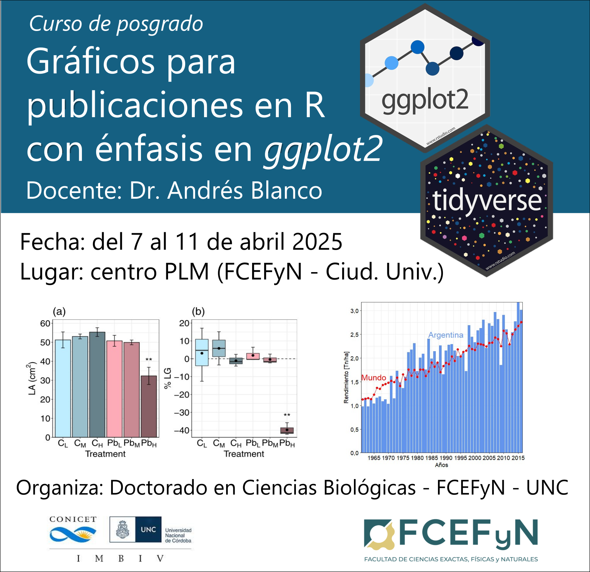

```{r setup, include=FALSE}
knitr::opts_chunk$set(echo = TRUE)
```

<p align="center">



</p>

## Índice de contenidos

-   [**Presentación del curso**](presentacion/presentacion.html)
-   [**Unidad 1. Introducción a R y RStudio**](unidad_1/unidad_1.html)
-   [**Unidad 2. Análisis y representación de datos numéricos**](unidad_2/unidad_2.html)

**Descarga todo el material del curso [aquí](https://github.com/pastornicolas/fundamentos_R/archive/refs/heads/main.zip)**


-------------------------------------


### Otros cursos orientados al uso de R

En el Doctorado de Ciencias Biológicas (FCEFyN, Universidad Nacional de Córdoba), se dictan con regularidad cursos introductorios y avanzados de modelos estadísticos en R:

-   **Introducción al lenguaje R. Modelos lineales y fundamentos de programación**. [Ver curso](https://curso-statscba.github.io/curso-R/){target="_blank"}
-   **Modelos Estadísticos Avanzados**. [Ver curso](https://curso-statscba.github.io/modelos_avanzados/){target="_blank"}
-   **Otros recursos:** existe una disponibilidad asombrosa de recursos digitales libres para aprender R, tanto en español como en inglés. Al final de la clase introductoria de este mismo curso brindamos una breve lista de refrencia. [Ir a clase introductoria](dia1/1.1_IntroR.pdf)

-------------------------------------

## Licencia

© 2025 Andrés Blanco. Bajo licencia [Creative Commons Attribution-NonCommercial-ShareAlike 4.0 International License](http://creativecommons.org/licenses/by-nc-sa/4.0/).

[](http://creativecommons.org/licenses/by-nc-sa/4.0/)
